# Global Startup Radar Architecture

This document explains the live RAG pipeline used by Global Startup Radar. The goal is to make the data flow visible: where data comes from, how it becomes chunks, how chunks become vectors, how Pinecone retrieves evidence, how reranking changes the order, and what is finally sent to Gemini.

## End-To-End Visual Diagram

```mermaid
flowchart TD
    user["User asks a startup trend question<br/>Example: Which AI startups are trending right now?"]

    subgraph sources["Data Sources"]
        ph["Product Hunt API<br/>Live startup/product launches<br/>name, tagline, description, topics,<br/>votes, comments, launch date, URLs"]
        demo["Demo sample fallback<br/>5 local sample startup records<br/>Used only when Demo sample mode is selected"]
        future["Planned enrichment sources<br/>YC profiles, startup news, company websites,<br/>funding announcements"]
    end

    subgraph ingestion["Ingestion And Normalization"]
        gql["Product Hunt GraphQL query<br/>posts(first, postedAfter, order: VOTES)"]
        normalize["Normalize each post into StartupEvidence<br/>startup_name, source_type, source_url,<br/>text, topics, sector, region, votes, comments"]
    end

    subgraph chunking["Chunking"]
        chunker["chunk_evidence_record()<br/>Creates source-aware EvidenceChunk objects"]
        chunktext["Chunk text includes:<br/>startup name, source, title, summary,<br/>topics, sector, location, published date"]
        metadata["Chunk metadata includes:<br/>chunk_id, source_type, source_url,<br/>topics, sector, region, votes, comments"]
    end

    subgraph embedding["Embedding And Vectorization"]
        gemembed["Gemini embeddings<br/>models/gemini-embedding-001<br/>output_dimensionality = 1024"]
        vectors["Dense vectors<br/>Numerical semantic representation<br/>of each startup evidence chunk"]
    end

    subgraph pinecone["Pinecone Vector Store"]
        upsert["Upsert vectors into Pinecone<br/>Index: global-startup-radar<br/>Metric: cosine<br/>Dimension: 1024"]
        metadatafilter["Metadata filters<br/>source_type, sector, region"]
        retrieve["Pinecone semantic retrieval<br/>Query is embedded, then top_k chunks<br/>are retrieved by vector similarity"]
        rawresults["Pinecone results before reranking<br/>Ordered by semantic similarity"]
    end

    subgraph rerank["Reranking And Trend Scoring"]
        score["compute_trend_score()<br/>semantic relevance, launch recency,<br/>Product Hunt votes, comments,<br/>source diversity, evidence count,<br/>sector or region match"]
        reranker["rerank_evidence()<br/>rerank_score = similarity contribution<br/>plus trend score contribution"]
        finalctx["Top reranked evidence chunks<br/>These become the cited context"]
    end

    subgraph llm["LLM Prompt And Generation"]
        prompt["build_answer_prompt()<br/>System instructions + user question<br/>+ numbered evidence snippets"]
        gemini["Gemini answer model<br/>gemini-2.5-flash"]
        answer["Final answer<br/>direct response, relevant startups,<br/>citations, caveats, no unsupported claims"]
    end

    subgraph ui["Streamlit Dashboard"]
        chat["Chat history<br/>multiple questions one by one"]
        table["Ranked startup table<br/>trend scores and metadata"]
        trace["Behind the scenes trace<br/>source chunks, Pinecone query,<br/>Pinecone output before rerank,<br/>reranked order, exact LLM input"]
    end

    ph --> gql --> normalize --> chunker
    demo --> normalize
    future -. future extension .-> normalize
    chunker --> chunktext --> gemembed
    chunker --> metadata --> upsert
    gemembed --> vectors --> upsert
    upsert --> retrieve
    user --> retrieve
    metadatafilter --> retrieve
    retrieve --> rawresults --> score --> reranker --> finalctx --> prompt --> gemini --> answer
    user --> chat
    answer --> chat
    finalctx --> table
    rawresults --> trace
    reranker --> trace
    prompt --> trace
```



## Runtime Flow

### 1. Live Data Fetch

The app starts in **Full live RAG** mode. It calls Product Hunt through `fetch_recent_product_hunt_posts()` using the configured `PRODUCT_HUNT_TOKEN`.

The current Product Hunt query requests posts ordered by votes:

```graphql
posts(first: $first, postedAfter: $postedAfter, order: VOTES)
```

The Streamlit sidebar controls:

- `Product Hunt launches`: how many launches to request.
- `Posted after date`: optional freshness filter.

### 2. Normalization

Each Product Hunt post is converted into a common `StartupEvidence` record by `product_hunt_post_to_evidence()`.

This makes all sources look consistent to the rest of the RAG system:

```text
Product Hunt post
-> StartupEvidence
-> EvidenceChunk
-> Gemini embedding
-> Pinecone vector
```

### 3. Chunking

`chunk_evidence_record()` creates a compact but source-aware chunk. The chunk is not just raw text. It includes enough context to be useful when retrieved on its own.

Chunk text includes:

- startup name
- source name and source type
- title
- summary or description
- topics
- sector
- region or country when available
- publication or launch date

Chunk metadata includes:

- `startup_name`
- `source_type`
- `source_name`
- `source_url`
- `published_at`
- `topics`
- `sector`
- `region`
- `country`
- `product_url`
- `product_hunt_votes`
- `product_hunt_comments`
- `yc_batch`

Before writing to Pinecone, metadata is sanitized by `sanitize_metadata()` so Pinecone only receives supported scalar values or lists of strings.

### 4. Embedding And Vectorization

The project uses Gemini embeddings through LangChain:

```text
Model: models/gemini-embedding-001
Output dimension: 1024
```

Each chunk becomes a dense vector. A dense vector is a numerical representation of the chunk's meaning. Similar startup descriptions should land near each other in vector space even when they do not use identical words.

### 5. Pinecone Storage

The vector store is Pinecone:

```text
Index: global-startup-radar
Metric: cosine
Dimension: 1024
```

`index_evidence()` converts loaded evidence into chunks and calls `upsert_chunks()`. This embeds each chunk and stores it in Pinecone with metadata.

### 6. Pinecone Retrieval

For each user question, the app uses `search_indexed_evidence()`.

The user query is embedded with the same Gemini embedding model. Pinecone compares the query vector against stored chunk vectors and returns the top matching chunks.

Optional metadata filters can narrow retrieval by:

- source
- sector
- region

The first Pinecone output is the **pre-reranking order**. This is the raw semantic search result.

### 7. Reranking And Trend Score

After Pinecone retrieval, `rerank_evidence()` reorders the retrieved chunks.

The reranker combines:

- Pinecone semantic similarity
- launch recency
- Product Hunt votes
- Product Hunt comments
- source diversity
- evidence count
- sector or region match

The trend score is an explainable heuristic from 0 to 100. It is not investment advice and it does not claim to predict funding, valuation, revenue, or future success.

### 8. LLM Input

`build_answer_prompt()` creates the exact prompt sent to Gemini.

The prompt contains:

- system instruction: act as a careful startup trend analyst
- user question
- numbered evidence snippets
- source URLs
- trend scores
- instruction to cite factual claims
- instruction not to make unsupported investment claims

This is the final RAG context. Gemini only receives the selected, reranked evidence.

### 9. LLM Output

Gemini `gemini-2.5-flash` generates the answer. The expected output includes:

- direct answer
- relevant startup names
- reasons they appear to be trending
- citations such as `[1]`
- caveats when evidence is thin

If the retrieved evidence does not include a fact, such as funding raised, the model should say the current evidence does not contain that information.

## Behind-The-Scenes Trace

The Streamlit app exposes the RAG trace for each question.

It shows:

1. Source chunks prepared for indexing.
2. Gemini embedding and Pinecone query details.
3. Pinecone retrieval output before reranking.
4. Final order after reranking.
5. Exact LLM input.

This makes the system explainable for project review. A reviewer can see the difference between raw vector retrieval and the final reranked context.

## Key Files

```text
global_startup_radar/app.py
  Streamlit dashboard and live RAG orchestration

global_startup_radar/src/startup_radar/ingestion/product_hunt.py
  Product Hunt GraphQL API fetching and normalization

global_startup_radar/src/startup_radar/chunking.py
  Source-aware chunk creation

global_startup_radar/src/startup_radar/vector_store.py
  Gemini embeddings and Pinecone vector store integration

global_startup_radar/src/startup_radar/live_pipeline.py
  Evidence indexing, Pinecone filters, and Pinecone search

global_startup_radar/src/startup_radar/reranking.py
  Reranking logic

global_startup_radar/src/startup_radar/scoring.py
  Trend score calculation

global_startup_radar/src/startup_radar/rag.py
  Final prompt construction and Gemini answer generation

global_startup_radar/src/startup_radar/trace.py
  Behind-the-scenes trace object
```

## Honest Scope

The current live source is Product Hunt. Product Hunt is strong for launch freshness, topics, votes, comments, and product descriptions. It is not a reliable source for funding, revenue, valuation, or investor history.

To answer funding-round questions, the project would need additional sources such as funding announcements, company press releases, Crunchbase or Dealroom access, or startup news articles.
